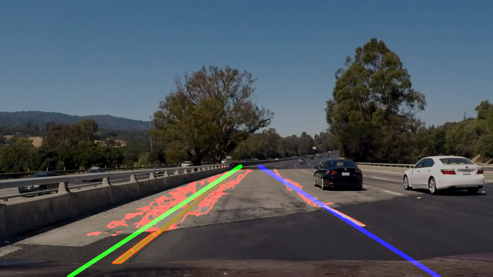
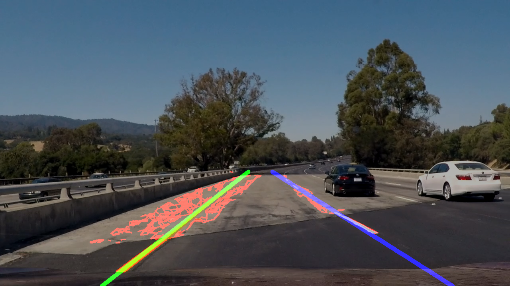

#**Finding Lane Lines on the Road** 

---

**Finding Lane Lines on the Road**

The goals / steps of this project are the following:
* Make a pipeline that finds lane lines on the road
* Reflect on your work in a written report

---

### Reflection

###1. Pipeline

My pipeline consisted of the following steps (implemented in file [LaneLinesFinder.py](LaneLinesFinder.py)):

1. Filter pixels by colors (retain white and yellow pixels)

2. Grayscale filtered image

3. Denoise grayscaled image using Gaussian blurring

4. Find edges using Canndy edge detector

5. Convert edges to line segments using Hough transform

6. Split line segments on the left and right line groups depending on angle between a current line and X-axis

7. Extrapolate line segments using Least Squares (numpy.polyfit is used)

I have disabled filtering yellow pixels code, cause color ranges, I used to separate pixels,
give good result for Challenge video, but for Yellow case such filtering gives worse result.
On the other hand currently used filtering produces a lot of noisy edges/lines 
on the Challenge video (cause retains wide range pixels) on the bright piece of the road (Red colors - line segments detected by HoughLines, Green - Left Lane, Blue - Right Lane):

To fix this problem I have tried cv2.fastNlMeansDenoising to denoise the image, it gave a good result, but had poor performance, so I decided to use other solution.

Then I have added averaging a lane line fit model using last (by default 10) models if the MSE for the fit model is greater than some pointed threshold value. The result is below:

###2. Potential shortcomings

My pipeline is not robust, I'm not sure that it will give a good result for more complex cases: 
* other cars ahead of us
* different wheather conditions (raining, snowing)
* night or even sunny day
* when a camera is not placed close to the center of a lane
* when a car is changing a lane
* straight lines is a poor model for winding roads

I tried to solve the last pointed case (winding roads at the Challenge case) using quadratic function,
but it gave very unstable result. I think because my edge/lines detector did not detect all necessary lines.

###3. Possible improvements

I think testing all above pointed potential shortcoming cases will produce a lot of the information for further improvements.

For some cases (for example sunny day) I think I should try to preprocess image, for example to use Histogram Equalization or CLAHE (Contrast Limited Adaptive Histogram Equalization).

For solving winding roads maybe appriximation by Bezier curve or B-spline will be the appripriate solution.

Also I think I should try to map an inital camera perspective image to 2D, generate lines and then map found lines back to the perspective image.